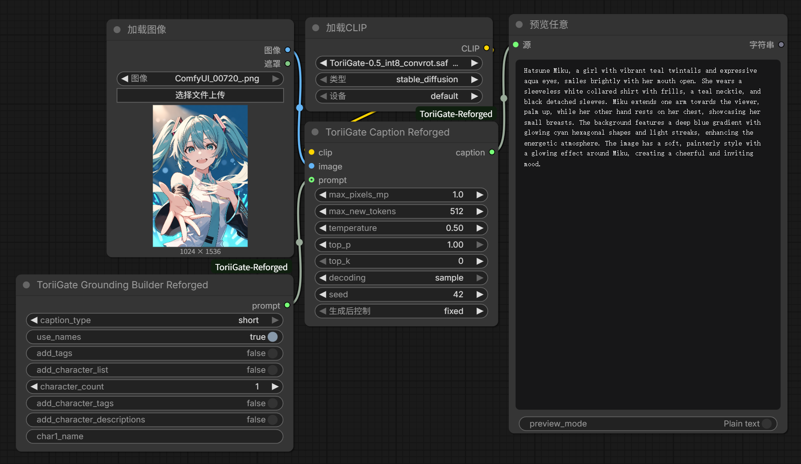
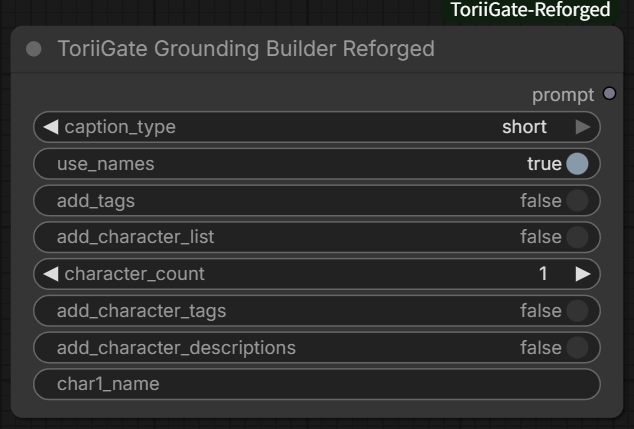
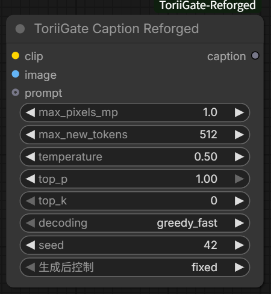
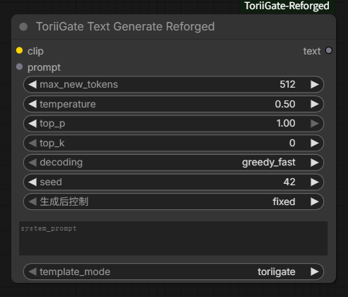

# ComfyUI-ToriiGate-Reforged

[English](README.md)

这是 [litch230/comfyui_toriigate](https://github.com/litch230/comfyui_toriigate) 的 Reforged 版本。新版删除了插件内置的 Transformers 模型加载器和 llama.cpp API 节点，改用 ComfyUI 原生 CLIP/Qwen3.5 完成模型加载、识图和生成。

## 主要改动

- 删除自定义模型加载、自动下载和 llama.cpp 后端。
- 使用 ComfyUI 原生 `加载CLIP / Load CLIP` 节点以及 ComfyUI 的模型/卸载管理。
- 直接使用 ToriiGate/Qwen3.5 CLIP 模型内置的视觉编码器，不再需要单独连接 vision。
- 保留原版 ToriiGate 提示词格式，在生成前关闭 thinking，并对齐原版的图像尺寸和视觉归一化处理。

旧工作流需要删除旧 ToriiGate 节点，重新添加 Reforged 节点并连接。

## 安装

将仓库克隆到 `ComfyUI/custom_nodes/`，然后重启 ComfyUI：

```bash
cd ComfyUI/custom_nodes
git clone https://github.com/CocyNoric/ComfyUI-ToriiGate-Reforged.git
```

## 模型放置与加载

推荐从以下仓库下载模型（中国用户推荐使用 ModelScope）：

- [Hugging Face：Ronysoc/ToriiGate-0.5-Int8-ConvRot](https://huggingface.co/Ronysoc/ToriiGate-0.5-Int8-ConvRot)
- [ModelScope：CocyNoric/ToriiGate-0.5-Int8-ConvRot](https://modelscope.cn/models/CocyNoric/ToriiGate-0.5-Int8-ConvRot)（中国用户推荐）

也可以从 [ToriiGate 原始仓库](https://huggingface.co/Minthy/ToriiGate-0.5)获取权重并进行合并。

将 ComfyUI 兼容的 ToriiGate `.safetensors` 权重（例如 `ToriiGate-0.5_int8_convrot.safetensors`）放到：

```text
ComfyUI/models/clip/
```

在 `加载CLIP / Load CLIP` 节点中选择：

- `CLIP名称 / clip_name`：ToriiGate 权重
- `类型 / type`：`stable_diffusion`
- `设备 / device`：`default`

## 使用方法与连接方式



可以直接把[示例工作流](assets/ToriiGate%20Inferencer%20Reforged.json)拖入 ComfyUI，或手动连接：

```text
加载CLIP.CLIP ─────────────────> ToriiGate Caption Reforged.clip
加载图像.IMAGE ────────────────> ToriiGate Caption Reforged.image
Grounding Builder.prompt ──────> ToriiGate Caption Reforged.prompt（可选）
ToriiGate Caption.caption ─────> 预览任意 / Preview Any.source
```

如需纯文本生成，将 `加载CLIP.CLIP` 连接到 `ToriiGate Text Generate Reforged.clip`，然后输入 prompt。

## 节点说明

### ToriiGate Grounding Builder Reforged

构建 ToriiGate 提示词，可选添加标签和角色信息。



#### Caption 类型

`caption_type` 用来控制输出格式和详细程度：

> **提示：** 推荐在一般场景下使用 `long` 模式。

> **注意：** 测试过程中发现，角色识别准确率有时可能不够理想，量化权重和原始权重均存在这一情况。

| 模式 | 输出内容 |
| --- | --- |
| `short` | 简短描述图片主体和主要细节。 |
| `long` | 使用 2–5 段自然语言详细描述图片。 |
| `long_thoughts` | 结构化输出角色判断、整体描述、局部内容、画面文字、背景和效果。 |
| `long_thoughts_v2` | 详细输出角色判断、关键细节、长描述和每个角色的独立描述。 |
| `json` | 使用 JSON 风格输出角色或主体、背景、画面效果、文字和氛围。 |
| `min_structured_md` | 较短的 Markdown 结构，包含关键细节、整体内容、角色和画面效果。 |
| `min_structured_json` | 精简 JSON 风格，包含整体、角色、效果、文字和水印字段。 |
| `json_comic` | 漫画专用 JSON，按分镜描述内容、角色和整体含义。 |
| `md_comic` | 漫画专用 Markdown，描述漫画布局和每个分镜。 |
| `chroma-style` | 同时输出常规总结、元素列表、Midjourney 风格总结和委托描述。 |

### ToriiGate Caption Reforged

使用连接的 CLIP 模型、图片和可选 grounding prompt 生成 caption。



### ToriiGate Text Generate Reforged

使用连接的 CLIP 模型进行纯文本生成。



## 致谢

- 原始 ComfyUI 插件：[litch230/comfyui_toriigate](https://github.com/litch230/comfyui_toriigate)
- ToriiGate 模型、提示词格式与推理参考：[Minthy/ToriiGate-0.5](https://huggingface.co/Minthy/ToriiGate-0.5)
